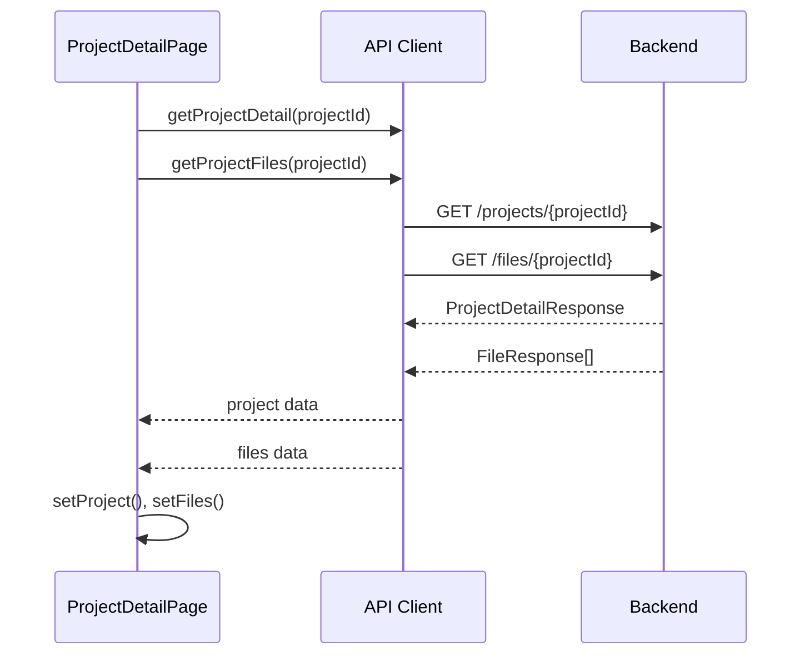
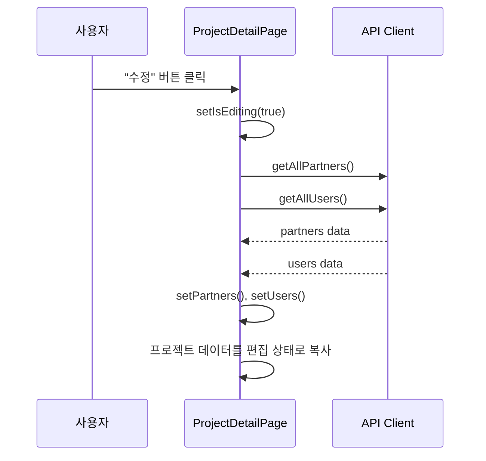
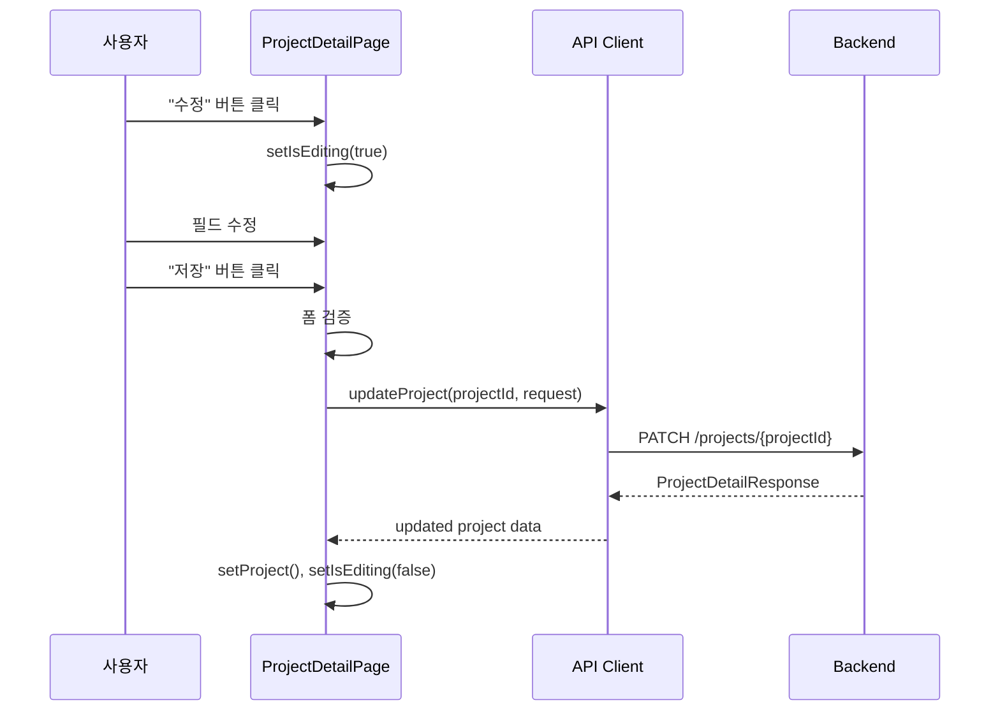
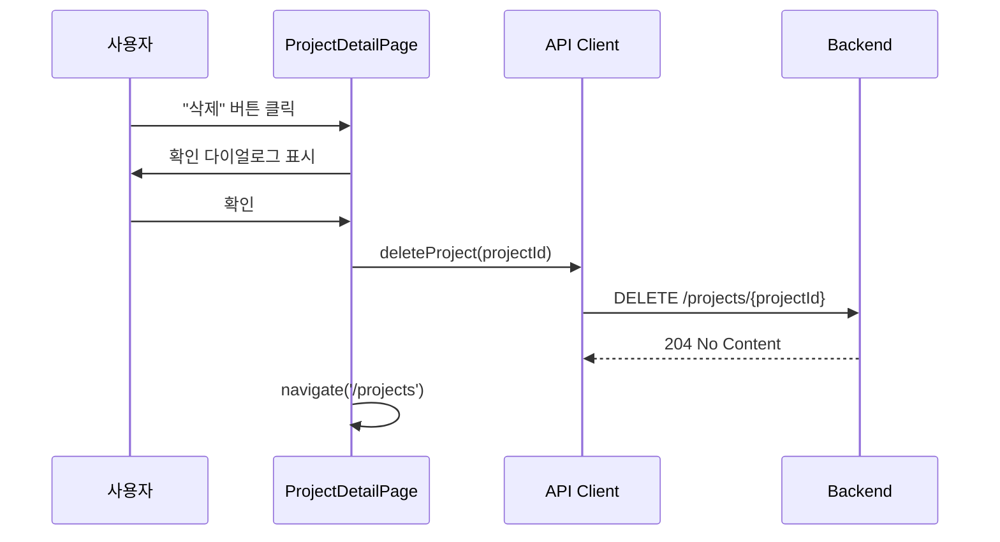
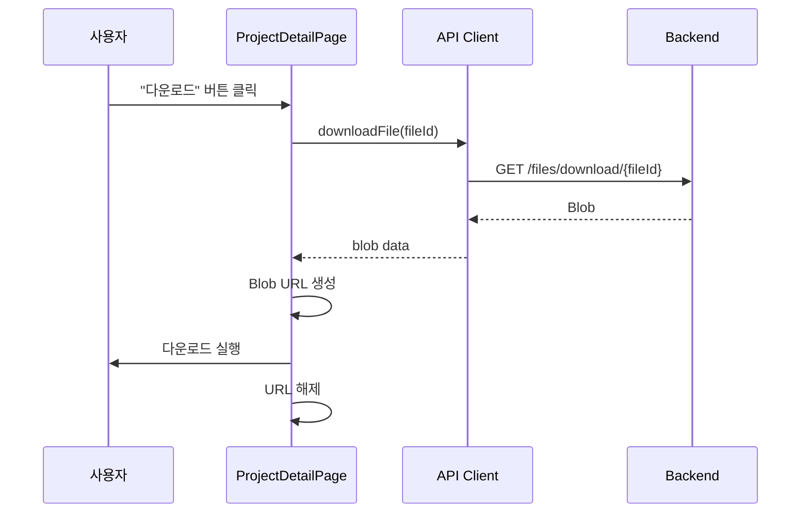
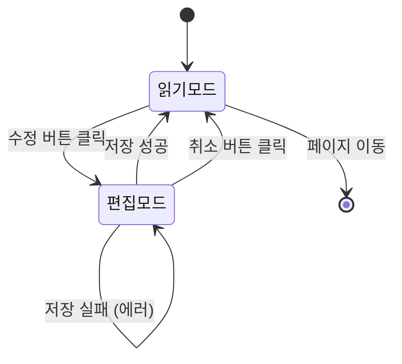

# 프로젝트 상세 페이지 개발 문서

## 개요

프로젝트 상세 페이지(`ProjectDetailPage.tsx`)는 프로젝트의 상세 정보를 조회하고, ADMIN 권한으로 수정/삭제할 수 있는 페이지입니다. 읽기 모드와 편집 모드를 구분하여 제공하며, 프로젝트 기본 정보, 멤버/연락처, 일정, 파일을 표시합니다.

## 1. 상태관리 (State Management)

### 1.1 왜 useState를 사용했을까?

프로젝트 등록 페이지와 동일한 이유로 `useState`를 사용합니다:

- **페이지 단위의 독립적인 상태**: 프로젝트 상세 페이지에서만 사용되는 상태
- **단순한 부모-자식 관계**: 상태를 하위 컴포넌트로 전달할 필요가 거의 없음
- **읽기/편집 모드 분리**: 모드를 전환하면서 상태를 관리하기 용이

### 1.2 주요 상태 구조

```typescript
// 프로젝트 데이터 상태
const [project, setProject] = useState<ProjectDetailResponse | null>(null);
const [files, setFiles] = useState<FileResponse[]>([]);
const [loading, setLoading] = useState<boolean>(false);
const [loadingFiles, setLoadingFiles] = useState<boolean>(false);
const [error, setError] = useState<string | null>(null);

// 편집 모드 상태
const [isEditing, setIsEditing] = useState<boolean>(false);
```

**왜 프로젝트 데이터와 파일을 분리했을까?**

1. **독립적인 로딩 상태**: 파일 목록 로딩 실패가 프로젝트 정보 표시를 막지 않음
2. **파일 삭제 시 UI 갱신**: 파일 삭제 후 해당 파일만 제거하여 즉시 반영
3. **성능 최적화**: 프로젝트 정보만 변경될 때 파일 목록을 다시 로딩할 필요 없음

### 1.3 편집 모드 상태

```typescript
// 편집 모드 상태 (프로젝트 등록 페이지와 동일한 구조)
const [name, setName] = useState<string>('');
const [clientId, setClientId] = useState<number | null>(null);
const [startDate, setStartDate] = useState<Date | null>(null);
const [endDate, setEndDate] = useState<Date | null>(null);
const [dateRange, setDateRange] = useState<[Date | null, Date | null]>([null, null]);
const [status, setStatus] = useState<string>('IN_PROGRESS');
const [description, setDescription] = useState<string>('');
const [colorCode, setColorCode] = useState<string>('#3b82f6');
```

**왜 프로젝트 등록 페이지와 동일한 구조를 사용했을까?**

- **코드 재사용성**: 프로젝트 등록 페이지의 컴포넌트와 로직을 재사용 가능
- **일관성**: 사용자가 편집할 때 동일한 UI/UX 경험
- **유지보수성**: 수정 시 두 페이지 모두에 동일한 변경사항 적용 가능

### 1.4 읽기/편집 모드 전환

```typescript
const [isEditing, setIsEditing] = useState<boolean>(false);
```

**왜 단일 boolean 상태로 관리할까?**

- **단순성**: 모드는 두 가지(읽기/편집)뿐이므로 boolean이 충분
- **조건부 렌더링**: `isEditing` 값에 따라 전체 UI를 조건부로 렌더링
- **상태 복원**: 편집 취소 시 원본 데이터로 쉽게 복원 가능

## 2. 데이터흐름 (Data Flow)

### 2.1 초기 데이터 로딩



**왜 Promise.all()을 사용했을까?**

프로젝트 정보와 파일 목록은 **서로 독립적**이므로 병렬로 로딩하면:
- **성능 향상**: 순차 로딩 대비 약 2배 빠름
- **사용자 경험**: 둘 중 하나가 실패해도 다른 하나는 표시 가능
- **에러 처리**: 각각 독립적으로 에러 처리 가능

### 2.2 편집 모드 진입 시 데이터 로딩



**왜 편집 모드 진입 시에만 로딩할까?**

- **초기 로딩 시간 단축**: 읽기 모드에서는 거래처/사원 목록이 필요 없음
- **네트워크 최적화**: 사용자가 수정하지 않으면 불필요한 API 호출 방지
- **데이터 최신성**: 편집 모드 진입 시점의 최신 데이터 보장

**왜 Promise.all()로 병렬 로딩했을까?**

거래처 목록과 사원 목록은 서로 독립적이므로 병렬 로딩이 효율적입니다:
- **성능**: 두 API 호출을 동시에 실행
- **에러 처리**: 하나가 실패해도 다른 하나는 처리 가능
- **로딩 상태**: 두 개의 독립적인 로딩 상태 관리

### 2.3 프로젝트 수정 플로우



**왜 수정 후 읽기 모드로 자동 전환할까?**

- **사용자 경험**: 수정 완료 후 즉시 결과 확인 가능
- **일관성**: 다른 CRUD 작업(생성, 삭제) 후에도 동일한 패턴
- **데이터 동기화**: 서버에서 반환된 최신 데이터로 상태 업데이트

### 2.4 프로젝트 삭제 플로우



**왜 확인 다이얼로그를 표시할까?**

삭제는 **되돌릴 수 없는 작업**이므로:
- **실수 방지**: 사용자가 의도치 않게 삭제하는 것을 방지
- **UX 표준**: 대부분의 웹 애플리케이션에서 사용하는 패턴
- **법적 요구사항**: 중요한 데이터 삭제 시 확인 절차 필요

### 2.5 파일 다운로드 플로우



**왜 Blob URL을 사용했을까?**

- **브라우저 호환성**: 모든 모던 브라우저에서 지원
- **메모리 관리**: `URL.revokeObjectURL()`로 메모리 누수 방지
- **보안**: 직접 파일 시스템 접근 없이 브라우저 다운로드 기능 활용

## 3. 화면 갱신 (UI Update)

### 3.1 읽기/편집 모드 전환

```typescript
// 편집 모드 진입
const handleEdit = () => {
  setIsEditing(true);
};

// 편집 취소
const handleCancel = () => {
  setIsEditing(false);
  setError(null);
  // 원본 데이터로 복원
  if (project) {
    setName(project.name);
    // ... 원본 데이터로 복원
  }
};
```

**왜 편집 취소 시 수동으로 복원할까?**

- **상태 분리**: 편집 상태와 원본 데이터를 분리하여 관리
- **안전성**: 편집 중인 상태가 원본 데이터에 영향을 주지 않음
- **사용자 경험**: 취소 시 즉시 원본 상태로 복원

**왜 useEffect로 자동 복사하지 않을까?**

`useEffect`를 사용하면 편집 모드 진입 시 자동으로 복사되지만, 취소 시에는 수동 복원이 필요합니다. 일관성을 위해 둘 다 수동으로 처리하는 것이 명확합니다.

### 3.2 조건부 렌더링

```typescript
{isEditing ? (
  <input
    type="text"
    value={name}
    onChange={(e) => setName(e.target.value)}
  />
) : (
  <div className="px-4 py-2 text-gray-900">{project.name}</div>
)}
```

**왜 삼항 연산자를 사용했을까?**

- **명확성**: 두 가지 모드가 명확하게 구분됨
- **가독성**: 코드를 읽기 쉬움
- **유지보수**: 각 모드의 UI를 독립적으로 수정 가능

### 3.3 프로젝트 수정 후 화면 갱신

```typescript
const updatedProject = await updateProject(projectId, updateRequest);
setProject(updatedProject);
setIsEditing(false);
```

**왜 서버 응답으로 상태를 갱신할까?**

- **데이터 정합성**: 서버에서 반환된 최신 데이터 사용
- **계산 필드**: 서버에서 계산된 필드(예: 업데이트 시간) 반영
- **다른 사용자 변경**: 동시 편집 시 다른 사용자의 변경사항 반영

### 3.4 파일 삭제 후 화면 갱신

```typescript
await deleteFile(fileId);
setFiles(files.filter((f) => f.id !== fileId));
```

**왜 서버에 재조회하지 않고 로컬에서 제거할까?**

- **성능**: 불필요한 API 호출 방지
- **사용자 경험**: 즉시 UI에서 제거되어 반응성 향상
- **단순성**: 삭제는 단순한 작업이므로 로컬 상태 업데이트로 충분

만약 파일 목록에 다른 정보(예: 파일 크기 합계)가 있다면, 서버에 재조회하는 것이 더 정확할 수 있습니다.

## 4. 레이아웃 구조 (Layout Structure)

### 4.1 전체 구조

```
ProjectDetailPage
├── 헤더
│   ├── 프로젝트 이름 (색상 코드 표시)
│   ├── 상태 배지
│   └── 액션 버튼 (목록으로, 수정, 삭제 - ADMIN만)
│
├── 상단 섹션: 기본 정보 및 메타 정보 (좌우 배치)
│   ├── 좌측: 기본 정보 카드
│   │   ├── 프로젝트 이름
│   │   ├── 거래처
│   │   └── 설명
│   │
│   └── 우측: 메타 정보 카드
│       ├── 기간
│       ├── 상태
│       └── 색상 코드
│
├── 중간 섹션: 팀 멤버 할당
│   ├── 사원(멤버) 목록 (왼쪽)
│   └── 거래처 연락처 목록 (오른쪽)
│
└── 하단 섹션: 일정 및 파일
    ├── 일정 목록 (읽기 전용)
    └── 파일 목록
        ├── 카테고리별 탭
        ├── 파일 목록 테이블
        └── 파일 액션 (다운로드, 삭제 - ADMIN만)
```

### 4.2 좌우 배치 레이아웃

**상단 섹션: 기본 정보 및 메타 정보**

```typescript
<div className="grid grid-cols-2 gap-6 mb-6">
  {/* 좌측: 기본 정보 카드 */}
  <div className="bg-white rounded-lg shadow p-6">
    {/* 프로젝트 이름, 거래처, 설명 */}
  </div>

  {/* 우측: 메타 정보 카드 */}
  <div className="bg-white rounded-lg shadow p-6">
    {/* 기간, 상태, 색상 코드 */}
  </div>
</div>
```

**왜 좌우로 배치했을까?**

1. **화면 공간 활용**: 세로로 배치하면 스크롤이 길어지고 공간이 낭비됨
2. **정보 그룹화**: 기본 정보와 메타 정보를 논리적으로 구분
3. **시각적 균형**: 좌우 대칭으로 시각적으로 안정감 제공

**왜 grid를 사용했을까?**

- **반응형**: 필요시 `md:grid-cols-1`로 모바일 대응 가능
- **일관성**: Tailwind CSS의 표준 레이아웃 시스템
- **유지보수**: CSS Grid의 장점(정렬, 간격 등) 활용

### 4.3 중간 섹션: 팀 멤버 할당

**레이아웃**: 2열 그리드 (`grid grid-cols-2 gap-6`)

**특징**:
- 사원과 연락처를 나란히 배치하여 비교하기 쉬움
- 각 영역은 독립적인 스크롤 가능 (`max-h-64 overflow-y-auto`)
- 읽기 모드와 편집 모드 구분

**읽기 모드 vs 편집 모드**

```typescript
{isEditing ? (
  // 편집 모드: 체크박스와 함께 표시
  <div className="border border-gray-200 rounded-lg p-4 max-h-64 overflow-y-auto">
    {users.map((user) => (
      <label className="flex items-center space-x-3">
        <input type="checkbox" />
        {/* 사용자 정보 */}
      </label>
    ))}
  </div>
) : (
  // 읽기 모드: 정보만 표시
  <div className="border border-gray-200 rounded-lg p-4">
    {project.members.map((member) => (
      <div className="flex items-center space-x-3">
        {/* 사용자 정보만 */}
      </div>
    ))}
  </div>
)}
```

**왜 두 가지 모드를 구분했을까?**

- **사용자 경험**: 읽기 모드에서는 선택 기능이 필요 없음
- **시각적 구분**: 모드에 따라 다른 UI 제공
- **접근성**: 편집 모드에서만 인터랙션 요소 제공

### 4.4 하단 섹션: 일정 및 파일

**일정 목록**: 읽기 전용 테이블

**왜 읽기 전용일까?**

- **복잡도 관리**: 일정 수정/삭제는 별도 페이지에서 관리
- **단순성**: 상세 페이지의 복잡도 감소
- **일관성**: 다른 페이지(일정 목록 페이지)에서 일정 관리

**파일 목록**: 카테고리별 탭 + 테이블

**왜 카테고리별로 탭을 사용했을까?**

- **정보 그룹화**: 파일을 카테고리별로 논리적으로 구분
- **화면 공간**: 한 번에 모든 파일을 표시하지 않고 필요한 카테고리만 표시
- **사용자 경험**: 프로젝트 등록 페이지와 동일한 UI 패턴

## 5. 주요 패턴 및 설계 원칙

### 5.1 읽기/편집 모드 패턴

**패턴 구조**:

1. **모드 상태**: `isEditing` boolean 상태
2. **데이터 복사**: 편집 모드 진입 시 원본 데이터를 편집 상태로 복사
3. **조건부 렌더링**: `isEditing` 값에 따라 다른 UI 렌더링
4. **데이터 복원**: 편집 취소 시 원본 데이터로 복원

**왜 이 패턴을 사용했을까?**

- **안전성**: 편집 중인 상태가 원본 데이터에 영향을 주지 않음
- **취소 기능**: 언제든지 편집을 취소하고 원본으로 돌아갈 수 있음
- **검증**: 저장 전에 클라이언트 측 검증 수행 가능

### 5.2 조기 반환 (Early Return)

```typescript
const handleSave = async () => {
  if (!id || !startDate || !endDate) return;
  
  // 검증
  if (!name.trim()) {
    setError('프로젝트 이름을 입력해주세요.');
    return;
  }
  // ...
};
```

**왜 early return을 사용했을까?**

- **가독성**: 중첩된 if-else를 피할 수 있음
- **명확성**: 에러 조건이 명확하게 드러남
- **유지보수**: 새로운 검증 조건 추가가 쉬움

### 5.3 에러 처리 패턴

```typescript
try {
  const updatedProject = await updateProject(projectId, updateRequest);
  setProject(updatedProject);
  setIsEditing(false);
  setError(null);
} catch (error: any) {
  console.error('프로젝트 수정 실패:', error);
  setError(error.response?.data?.message || '프로젝트 수정에 실패했습니다.');
} finally {
  setLoading(false);
}
```

**왜 finally 블록을 사용했을까?**

- **안전성**: 성공/실패와 관계없이 로딩 상태를 해제
- **사용자 경험**: 에러 발생 후에도 UI가 로딩 상태로 남지 않음
- **코드 중복 방지**: 성공/실패 분기에 각각 로딩 해제 코드를 작성할 필요 없음

### 5.4 권한 처리

```typescript
const { user } = useAuthStore();
const isAdmin = user?.role === 'ADMIN';

// 조건부 렌더링
{isAdmin && (
  <button onClick={handleEdit}>수정</button>
)}
```

**왜 컴포넌트 레벨에서 권한을 체크할까?**

- **보안**: UI에서 숨기는 것만으로는 충분하지 않지만, 사용자 경험 개선
- **서버 검증**: 실제 권한 검증은 서버에서 수행 (API 호출 시 403 에러)
- **접근성**: 권한이 없는 사용자에게는 관련 기능을 표시하지 않음

## 6. 상태 전이 다이어그램

### 6.1 편집 모드 전이



**상태 전이 설명**:

1. **초기 상태**: 읽기 모드
2. **편집 모드 진입**: "수정" 버튼 클릭 → `setIsEditing(true)`
3. **저장 성공**: API 호출 성공 → `setIsEditing(false)`
4. **취소**: "취소" 버튼 클릭 → 원본 데이터 복원 → `setIsEditing(false)`
5. **저장 실패**: API 호출 실패 → 에러 메시지 표시 → 편집 모드 유지

## 7. 컴포넌트 구조

### 7.1 주요 컴포넌트

프로젝트 상세 페이지는 단일 컴포넌트로 구성되어 있습니다:

- **ProjectDetailPage**: 메인 컴포넌트 (모든 로직 포함)

**왜 단일 컴포넌트로 구성했을까?**

- **복잡도**: 현재 수준에서는 컴포넌트 분리로 인한 복잡도 증가가 이득보다 큼
- **상태 공유**: 많은 상태를 공유하므로 컴포넌트 분리 시 prop drilling 발생
- **유지보수**: 단일 파일에서 모든 로직을 관리하기 쉬움

**향후 개선 가능성**:

복잡도가 높아지면 다음과 같이 분리할 수 있습니다:

```typescript
// 예시: 향후 개선 방향
<ProjectDetailHeader project={project} isEditing={isEditing} />
<ProjectDetailBasicInfo ... />
<ProjectDetailMetaInfo ... />
<ProjectDetailMembers ... />
<ProjectDetailSchedules ... />
<ProjectDetailFiles ... />
```

### 7.2 재사용 컴포넌트

- **ColorPicker**: 색상 선택 컴포넌트 (프로젝트 등록 페이지와 공통)
- **Alert**: 에러/성공 메시지 표시 컴포넌트

**왜 이 컴포넌트들을 재사용했을까?**

- **일관성**: 전체 애플리케이션에서 동일한 UI 제공
- **유지보수**: 한 곳에서 수정하면 전체에 반영
- **코드 재사용**: 중복 코드 제거

## 8. 개선 가능한 부분

### 8.1 상태 관리 최적화

현재는 여러 개의 `useState`를 사용하고 있지만, 복잡도가 높아지면 `useReducer`를 고려할 수 있습니다:

```typescript
// 현재
const [isEditing, setIsEditing] = useState(false);
const [name, setName] = useState('');
// ... 10개 이상의 useState

// 개선안 (복잡도가 높아질 경우)
const [state, dispatch] = useReducer(projectDetailReducer, initialState);
```

하지만 현재 수준에서는 `useState`가 더 직관적이고 관리하기 쉽습니다.

### 8.2 에러 처리 개선

현재는 모든 에러를 하나의 `error` 상태로 관리합니다. 각 필드별 에러 메시지를 표시하려면:

```typescript
const [errors, setErrors] = useState<Record<string, string>>({});
```

이렇게 하면 "프로젝트 이름을 입력해주세요"와 "거래처를 선택해주세요"를 동시에 표시할 수 있습니다.

### 8.3 로딩 상태 통합

현재는 각 API별로 로딩 상태를 분리했지만, 사용자 경험 측면에서 전체 로딩 인디케이터를 추가할 수도 있습니다:

```typescript
const [isSubmitting, setIsSubmitting] = useState(false);
```

### 8.4 파일 목록 갱신

현재는 파일 삭제 후 로컬에서만 제거합니다. 만약 파일 목록에 계산된 값(예: 총 파일 크기)이 있다면, 서버에 재조회하는 것이 더 정확할 수 있습니다:

```typescript
// 개선안
await deleteFile(fileId);
// 파일 목록 재조회
const updatedFiles = await getProjectFiles(projectId);
setFiles(updatedFiles);
```

## 9. 테스트 전략

### 9.1 단위 테스트

- 각 핸들러 함수의 로직 검증
- 폼 검증 로직 테스트
- 날짜 범위 검증 테스트
- 권한 체크 로직 테스트

### 9.2 통합 테스트

- API 호출 순서 검증
- 프로젝트 수정 후 데이터 갱신 검증
- 파일 삭제 후 목록 갱신 검증
- 에러 처리 검증

### 9.3 E2E 테스트

- 전체 프로젝트 조회 플로우
- 편집 모드 전환 플로우
- 프로젝트 수정 플로우
- 파일 다운로드 플로우

## 10. 참고 자료

- [React 공식 문서 - useState](https://react.dev/reference/react/useState)
- [React 공식 문서 - useEffect](https://react.dev/reference/react/useEffect)
- [react-datepicker 문서](https://reactdatepicker.com/)
- [React Router - useNavigate](https://reactrouter.com/en/main/hooks/use-navigate)
- [프로젝트 등록 페이지 문서](createProject.md)

